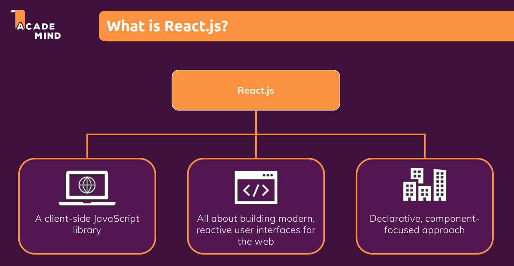
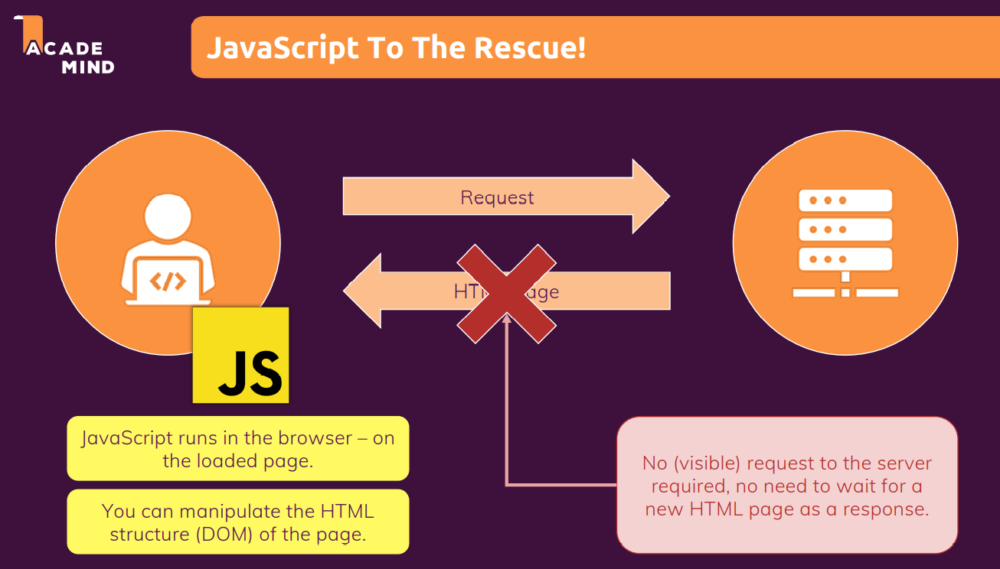
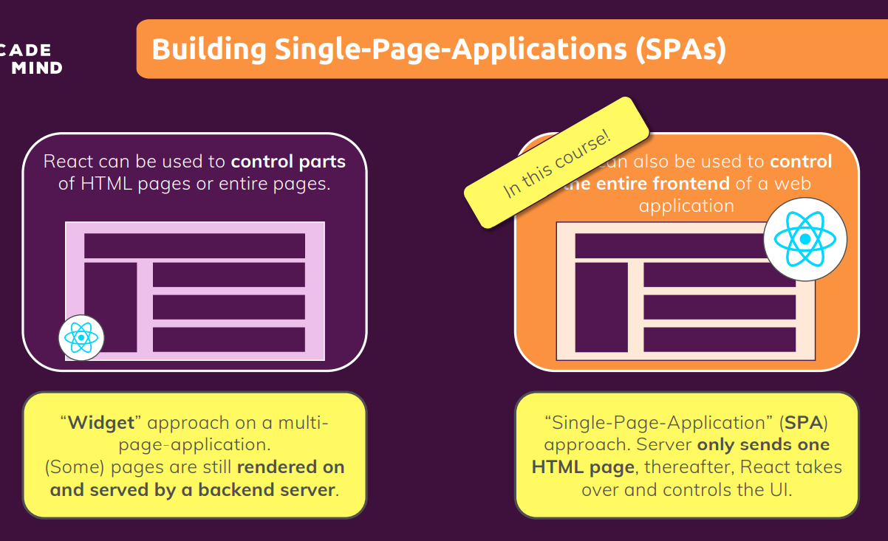
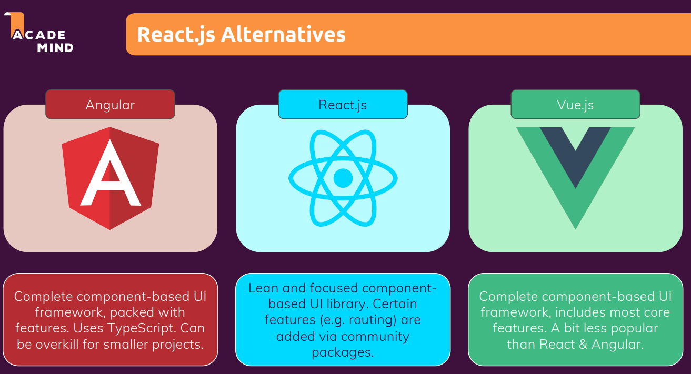

# What is React ?

- React is a JavaScript Library for building user interfaces.
- Eg: Netflix website is build using ReactJS.
- It is highly interactive and runs pretty smoothly when we work with it.
- It's easy to use and we don't have to wait for anything to load, we have nice transitions.

*Traditionally - when we clicked a link or a button, our request was sent to a server and a new HTML page was sent back to the browser where it then could be displayed. Websites could feel a bit clunky, we might have that latency where we wait for this new HTML page to load and so on.*

- React might be an extra building block, and indeed.
- React.js is a client-side JavaScript library.
- It helps us with writing that client-side JavaScript code and it's all about building modern reactive user
  interfaces for websites.
- React.js has and gives you that make building complex user interfaces easy.

## Why React instead of JavaScript ?

- JavaScript uses imperative approach means that every single step needs to be described.
- But React is all about splitting your application into small building blocks, small components, where every building block, every component, has a clear task and therefore your code stays maintainable and manageable.
- React, the library, will do the heavy lifting of rendering something on the screen and of combining all your code.
- we want to use React.js, it makes building modern, rich, complex user interfaces easier.

## Building Single-Page Appliation (SPAs) with React

eg: Netflix is built with React and there we never request a second HTML Page.
Hence, it's a SPAs where after the initial request react takes over and controls what we see on the screen.

## React.js Alternatives

