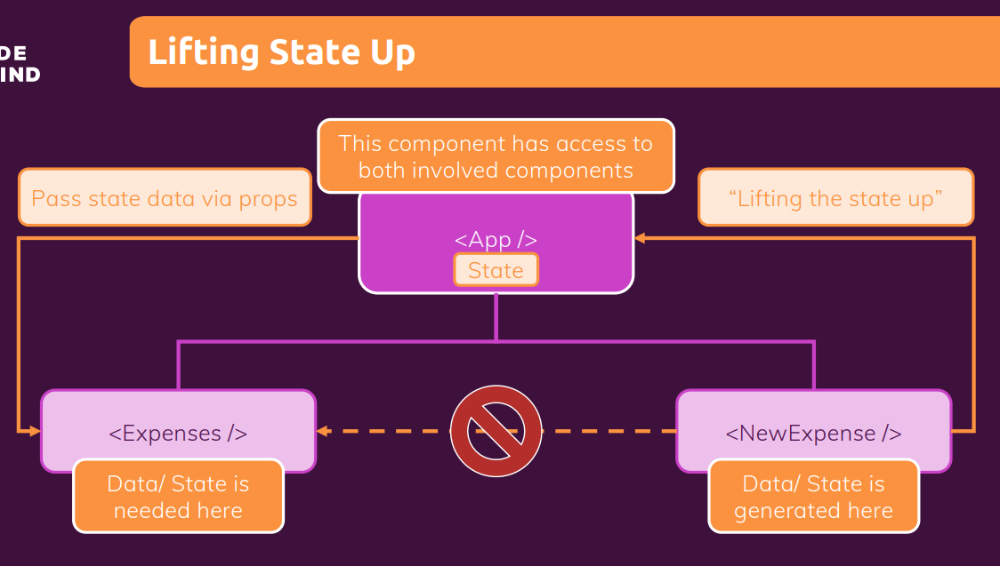

# **Lifting State Up**

- It is about moving data from a child component to some parent component to either use it there or to then pass it down to some other child component.

- In our example we are fetching the data from form(ExpenseForm) then lifting up to NewExpense and then again Lifting it up to 'App' component and after that app component is passing the data into Expense component using Prop method.

