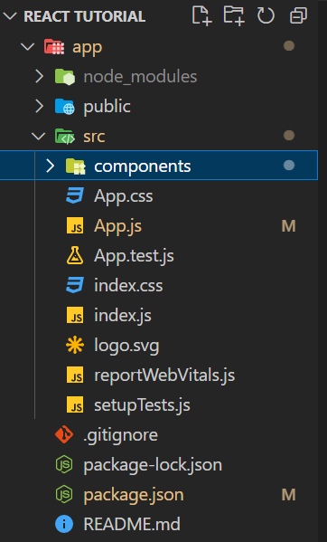

# **What are Components? And Why is React All About Them?**

We can build any website without React but if we are having more complex user interfaces. React will make much easier to build complex projects.

- React is a JavaScript library for building user interfaces.
- HTML, CSS & JavaScript are about building user interfaces as well.
- React makes building complex, interactive and reactive user interfaces simpler.
- React is all about “Components".
- React embraces a concept called components.
- Components are, reusable building blocks in your user interface.
- Components are in the end just a combination of HTML code, CSS code for styling and possibly JavaScript code
  for some logic.
- React is all about “Components” Because all user interfaces in the end are made up of components.

## **Why Components**

- Having reusable building blocks helps us avoid repetition.
- Having a separation of concerns helps us with keeping our code base small and manageable instead of having  
  one large file which holds all the HTML code and all the JavaScript logic.


## **How is a Component Built?**

- We combine HTML, CSS and JavaScript in all these components and then we combine all of these components together to build the entire user interface.


## **React & Components**

- React uses Declarative approach.


## **Building a First Custom Component**



- App component(App.js) will be a special kind of component, it's our root component.
- Means it's the main component being rendered here in our starting file in index.js. And all other components will be either nested inside of App.js or nested inside of other components which then in turn again are nested somewhere else. Because ultimately with React we build a Component Tree.


### **Code for building component**

``` JavaScript

//loading Expenses which is another component 
import Expenses from './components/Expenses/Expenses'; 


const App = () => { //data that's need to be loaded in other component.
  const expense = [
    {
      id: "e1",
      title: "Mobile Insurance",
      amount: 320.6,
      date: new Date(2023, 2, 2),
    }
  ];

  return ( //JSX code 
    <div>
      <h2>Let's get started!</h2>
      <Expenses items={expense} /> <!-- method to call another component using custom HTML element.>
    </div>
  );
}

export default App; // exporting the App function which can be used in other files.
```
