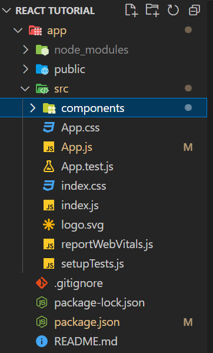

# **Creating a New React Project**

To create react project we will be using a React toolchain i.e - 'Create React App'

## Why toolchain ?

React toolchains which help with tasks like:

- Scaling to many files and components.
- Using third-party libraries from npm.
- Detecting common mistakes early.
- Live-editing CSS and JS in development.
- Optimizing the output for production.
- Use an integrated toolchain for the best user and developer experience.

## Availabe toolchains and purpose

- If you’re **learning React** or **creating a new single-page app**, use *Create React App*.
- If you’re **building a server-rendered website** with Node.js, try *Next.js*.
- If you’re building a **static content-oriented website**, try *Gatsby*.
- If you’re building a **component library or integrating with an existing codebase**, try *More Flexible Toolchains*.

## **Create React App**

Create React App is a comfortable environment for learning React, and is the best way to start building a new single-page application in React.

**To create a project, run:**

``` create project
npx create-react-app my-app
cd my-app
npm start
```

> *Note:* npx - it’s a package runner tool that comes with npm 5.2+.

- Create React App doesn’t handle backend logic or databases; it just creates a frontend build pipeline, so you can use it with any backend you want.

Once above mentioned code runs below pipeline structure will be created on specified path.



## **ToolChain Consits of**

A JavaScript build toolchain typically consists of:

1. A **package manager**, such as *Yarn or npm*.
2. A **bundler**, such as *webpack or Parcel*.
3. A **compiler** such as *Babel*.

- *Package manager* : It lets you take advantage of a vast ecosystem of third-party packages, and easily install or update them.
- *Bundler* : It lets you write modular code and bundle it together into small packages to optimize load time.
- *Compiler* : It lets you write modern JavaScript code that still works in older browsers.
