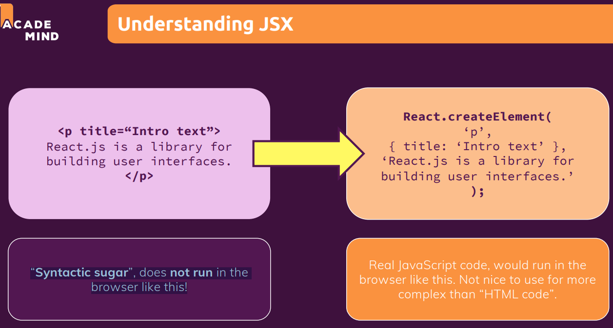

# **JSX - "HTML in JavaScript"**

* JSX stands for JavaScript XML because HTML in the end is XML.
* JSX means build your own, custom HTML Elements.
* JSX is a “Syntactic sugar”, does not run in the browser.
* JSX code only works because there are transformation steps running behind the scenes because of this process,npm start process which we started which transformed this JavaScript code to more browser friendly code before everything is being served here.
* React automatically transformed the code which does run in the browser so that we have the best of both worlds, code which works in the browser which obviously is important and code which is easy to write for us as a developer.

**Note:** Code written inside return keyword is JSX code we have defined HTML codes inside JavaScript function.

``` JSX Code Example
import './ExpenseDate.css'

const ExpenseDate = (props) => {
  const month = props.date.toLocaleString("en-US", { month: "long" });
  const day = props.date.toLocaleString("en-US", { day: "2-digit" });
  const year = props.date.getFullYear();

  return (
   // JSX Code
    <div className='expense-date'>
      <div className='expense-date__month'>{month}</div>
      <div className='expense-date__day'>{day}</div>
      <div className='expense-date__year'>{year}</div>
    </div>
   // 
  );
}

export default ExpenseDate;
```


