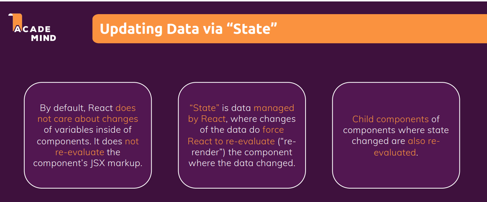

# **State**

- When a button clicked and that button should change some text which is being output. So we need a way of telling React that something changed and that a certain component should be re-evaluated and that's where React introduces a special concept called state.



- To tell React that it should run it again we need to **import react library**.
- In order to import sepcific function from library include inside {} i.e {useState}.
- useState is a function provided by the react library.
- useState is a so called react hook.
- hooks must only be called inside of react component functions
- It allows us to define values as state where changes to these values should reflect in the component function being called again which is a key difference to the regular variable we are using here.

```JavaScript
import React, {useState} from 'react'

const functioncomp = (props) => {
    const [entitletitle,setTitle] = useSate(props.title)

    const handlerfunc = (event) =>{
    setTitle('updated')
    }
}
```

## **Important**

1. **State is separated on a per component instance basis. Without State, our user interface would never change.** It means whenever State changes because we click a button in this case it's only this component function and only that specific instance where this component is being used where React will re-evaluate it.

2. **State which adds reactivity to our application.** State is simple though. You just register State with useState, you always get back two values; the value itself and the updating function. You call the updating function whenever the State should change, and you use that first element whenever you wanna use the State value, like here for outputting it in the JSX code. And React, will do the rest and it will re-execute the component function and re-evaluate the JSX code therefore; whenever the State changes.
